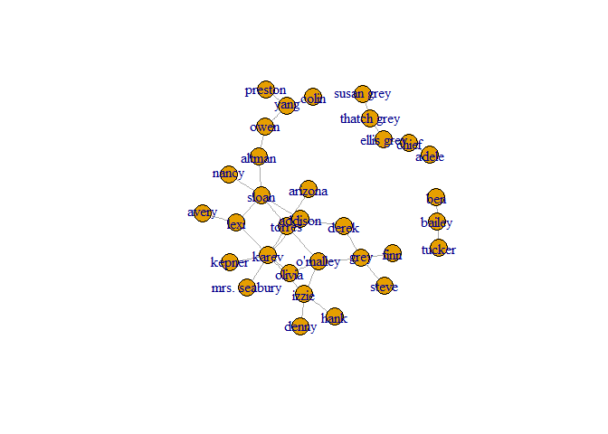
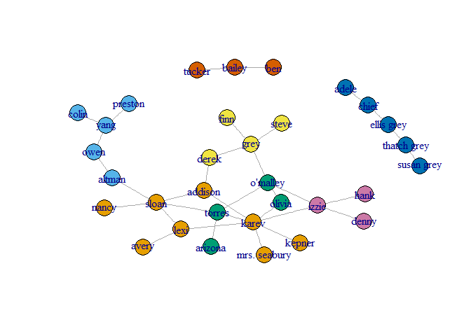
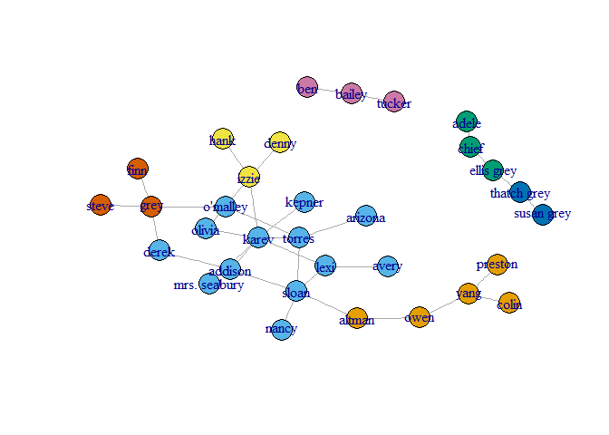
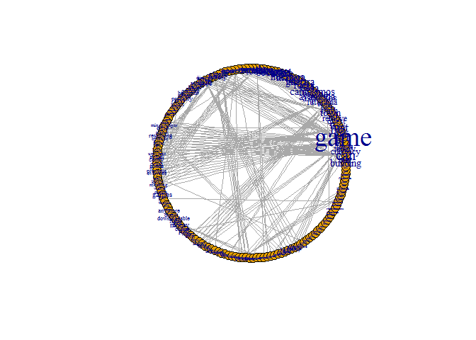
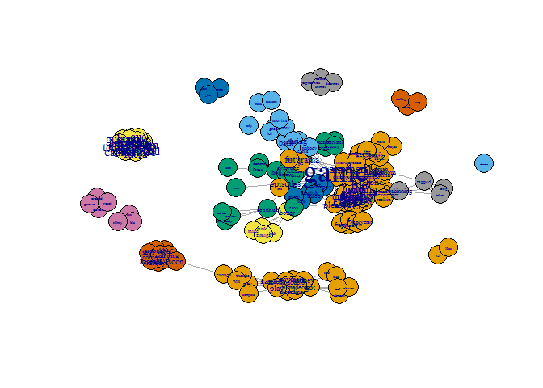
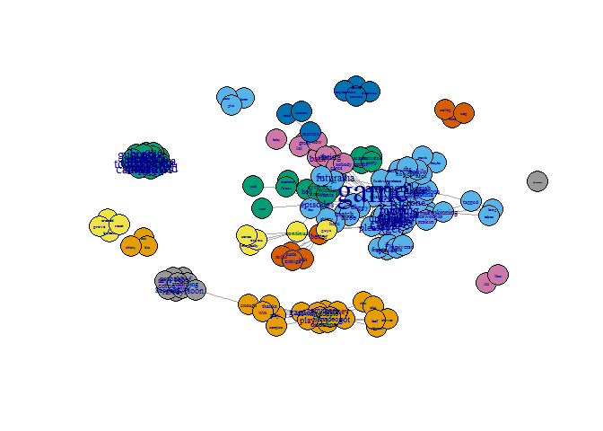

HW3
================
Yariv Dahan

Ex3
===

Question 1
----------

first, we will load the data and look at the graph:

``` r
library(igraph)
```

    ## 
    ## Attaching package: 'igraph'

    ## The following objects are masked from 'package:stats':
    ## 
    ##     decompose, spectrum

    ## The following object is masked from 'package:base':
    ## 
    ##     union

``` r
ga.data <- read.csv('ga_edgelist.csv', header = T)
g <- graph.data.frame(ga.data,directed = F)
plot(g)
```



``` r
#in order to get the same result at each run, we will set a constant seed.
set.seed(123)
```

### a.

Calculate **betweenness** score:

``` r
q1a.betweenness = betweenness(g)
q1a.betweenness
```

    ##         lexi         owen        sloan       torres        derek 
    ##     36.00000     60.00000    115.36667     67.15000     17.95000 
    ##        karev     o'malley         yang         grey        chief 
    ##     95.26667     54.41667     43.00000     46.86667      3.00000 
    ##   ellis grey   susan grey       bailey        izzie       altman 
    ##      4.00000      0.00000      1.00000     47.95000     76.00000 
    ##      arizona        colin      preston       kepner      addison 
    ##      0.00000      0.00000      0.00000      0.00000     44.08333 
    ##        nancy       olivia mrs. seabury        adele  thatch grey 
    ##      0.00000      4.95000      0.00000      0.00000      3.00000 
    ##       tucker         hank        denny         finn        steve 
    ##      0.00000      0.00000      0.00000      0.00000      0.00000 
    ##          ben        avery 
    ##      0.00000      0.00000

The vertex with the highest betweeness score is:

``` r
q1a.max_betweenness <- as.numeric(which(max(q1a.betweenness) == q1a.betweenness))
q1a.betweenness[q1a.max_betweenness]
```

    ##    sloan 
    ## 115.3667

Calculate **closeness** score:

``` r
q1a.closeness = closeness(g)
q1a.closeness
```

    ##         lexi         owen        sloan       torres        derek 
    ##  0.003115265  0.002898551  0.003174603  0.003194888  0.003039514 
    ##        karev     o'malley         yang         grey        chief 
    ##  0.003174603  0.003134796  0.002754821  0.003003003  0.001148106 
    ##   ellis grey   susan grey       bailey        izzie       altman 
    ##  0.001149425  0.001144165  0.001075269  0.003076923  0.003039514 
    ##      arizona        colin      preston       kepner      addison 
    ##  0.002985075  0.002597403  0.002597403  0.002967359  0.003174603 
    ##        nancy       olivia mrs. seabury        adele  thatch grey 
    ##  0.002967359  0.003039514  0.002967359  0.001144165  0.001148106 
    ##       tucker         hank        denny         finn        steve 
    ##  0.001074114  0.002881844  0.002881844  0.002816901  0.002816901 
    ##          ben        avery 
    ##  0.001074114  0.002915452

The vertex with the highest closeness score is:

``` r
q1a.max_closeness <- as.numeric(which(max(q1a.closeness) == q1a.closeness))
q1a.closeness[q1a.max_closeness]
```

    ##      torres 
    ## 0.003194888

Calculate **eigenvector** score:

``` r
q1a.eigenvector = eigen_centrality(g)
q1a.eigenvector$vector
```

    ##         lexi         owen        sloan       torres        derek 
    ## 5.255806e-01 6.780381e-02 6.418121e-01 7.178773e-01 2.500302e-01 
    ##        karev     o'malley         yang         grey        chief 
    ## 1.000000e+00 6.006975e-01 2.394956e-02 3.004927e-01 1.502785e-17 
    ##   ellis grey   susan grey       bailey        izzie       altman 
    ## 5.981489e-17 3.061166e-17 1.053887e-17 5.653959e-01 2.077024e-01 
    ##      arizona        colin      preston       kepner      addison 
    ## 2.101205e-01 7.009961e-03 7.009961e-03 2.926969e-01 5.537364e-01 
    ##        nancy       olivia mrs. seabury        adele  thatch grey 
    ## 1.878564e-01 4.685192e-01 2.926969e-01 1.254455e-17 4.011021e-17 
    ##       tucker         hank        denny         finn        steve 
    ## 2.255230e-18 1.654896e-01 1.654896e-01 8.795329e-02 8.795329e-02 
    ##          ben        avery 
    ## 0.000000e+00 1.538358e-01

The vertex with the highest betweeness score is:

``` r
q1a.max_eigenvector <- as.numeric(which(max(q1a.eigenvector$vector) == q1a.eigenvector$vector))
q1a.eigenvector$vector[q1a.max_eigenvector]
```

    ## karev 
    ##     1

### b. community detection:

**First algorithm - Girvan-Newman:**

``` r
q1b.gn <-  edge.betweenness.community(g)
plot(g, vertex.size=10, vertex.color=membership(q1b.gn), asp=FALSE)
```

 We can see in this graph we has 7 communities (7 colors). 2 communities are seperated form the others and there are 5 communities that are connected.

the size of the community and number of members:

``` r
sizes(q1b.gn)
```

    ## Community sizes
    ## 1 2 3 4 5 6 7 
    ## 8 5 4 4 5 3 3

(The first row is community ID, sizes are written in the second row).

modularity value (returns max value):

``` r
modularity(q1b.gn)
```

    ## [1] 0.5774221

According to Girvan-Newman algorithm, there are 7 communities, the larger has 8 vertexes.

**Second algorithm - walktrap:**

``` r
q1b.walktrap <- walktrap.community(g)
plot(g, vertex.size=10, vertex.color=membership(q1b.walktrap), asp=FALSE)
```

 We can see in this graph we has 7 communities (7 colors). 1 community is seperated form the others, 2 communities are connected(Grey family) and the largest connectivity has 4 communities.

The size of the community and number of members:

``` r
sizes(q1b.walktrap)
```

    ## Community sizes
    ##  1  2  3  4  5  6  7 
    ##  5 13  3  3  2  3  3

we have a total of 7 communities (the first row is community ID, sizes are written in the second row).

modularity value (returns max value):

``` r
modularity(q1b.walktrap)
```

    ## [1] 0.5147059

According to walktrap algorithm, there are 7 communities, the larger has 13 vertexes.

Question 2
----------

### a. Data collection

First we will install and load devtools and Rfacebook

``` r
#install.packages("devtools")
library(devtools)
#install_github("Rfacebook", "pablobarbera", subdir="Rfacebook")
require(Rfacebook)
```

    ## Loading required package: Rfacebook

    ## Loading required package: httr

    ## Loading required package: rjson

    ## Loading required package: httpuv

    ## 
    ## Attaching package: 'Rfacebook'

    ## The following object is masked from 'package:methods':
    ## 
    ##     getGroup

we used this guide to connect to Facebook's API: <http://thinktostart.com/analyzing-facebook-with-r/>

load the app authentication file (long-lived OAuth token):

``` r
load("fb_oauth_Yariv")
```

Note: due to security reasons, this file wasn't uploaded to the repository.

We will get the latest post (with getPage function) and from that post we will get 50 comments (with getPost function, using the post ID). Then, we will take only the messages in order to create a vector:

``` r
q2.fb_page <- getPage(page="Futurama", token=fb_oauth_Yariv, n=1)
```

    ## 1 posts

``` r
q2.fb_post <- getPost(post=q2.fb_page$id[1], token=fb_oauth_Yariv, n=50)
q2.fb_comments <- q2.fb_post$comments$message
head (q2.fb_comments, n=2)
```

    ## [1] "Can we get rid of the quest lines that force you to buy in game currency just to remove them? Until then this game goes in the trash with the family guy town building game."
    ## [2] "Bring back futurama!"

We got our raw data, we will preprocess it:

``` r
Clean_String <- function(string){
    # Lowercase
    temp <- tolower(string)
    #' Remove everything that is not a number or letter 
    temp <- stringr::str_replace_all(temp,"[^a-zA-Z'0-9\\s]", "")
    # Shrink down to just one white space
    temp <- stringr::str_replace_all(temp,"[\\s]+", " ")
    # Get rid of trailing "" if necessary
    indexes <- which(temp == "")
    if(length(indexes) > 0){
      temp <- temp[-indexes]
    } 
    return(temp)
}
q2.fb_comments <- sapply(X=q2.fb_comments,FUN=Clean_String)
head(q2.fb_comments,n = 2)
```

    ## $`Can we get rid of the quest lines that force you to buy in game currency just to remove them? Until then this game goes in the trash with the family guy town building game.`
    ## [1] "can we get rid of the quest lines that force you to buy in game currency just to remove them until then this game goes in the trash with the family guy town building game"
    ## 
    ## $`Bring back futurama!`
    ## [1] "bring back futurama"

We can see the first two comments before and after preprocess.

We got our data.

### b. Creating corpus

Now we are ready to build the corpus. It will contain each comment as a document and each word as a term:

``` r
library(tm)
```

    ## Loading required package: NLP

    ## 
    ## Attaching package: 'NLP'

    ## The following object is masked from 'package:httr':
    ## 
    ##     content

``` r
q2.corpus <- Corpus(VectorSource(q2.fb_comments))
```

We want to remove stop words (after several tries, we saw that the graph is too complicated, so we "shaved" it):

``` r
q2.corpus <- tm_map(q2.corpus, removeWords, stopwords("english"))
```

The term-document matrix will contain a binary weight, meaning '1' if term a is in document 1 or '0' otherwise.

``` r
q2.td_matrix <- TermDocumentMatrix(q2.corpus, control = list(weighting=weightBin))
q2.td_matrix <- as.matrix(q2.td_matrix)
head(q2.td_matrix)
```

    ##           Docs
    ## Terms      1 2 3 4 5 6 7 8 9 10 11 12 13 14 15 16 17 18 19 20 21 22 23 24
    ##   building 1 0 0 0 0 0 1 0 0  0  0  0  0  0  0  0  0  0  0  0  0  0  0  0
    ##   buy      1 0 0 0 0 0 0 0 0  0  0  0  0  0  0  0  0  0  0  0  0  0  0  0
    ##   can      1 0 0 0 0 0 0 0 0  1  1  0  0  0  0  0  0  0  0  0  0  0  0  0
    ##   currency 1 0 0 0 0 0 0 0 0  0  0  0  0  0  0  0  0  0  0  0  0  0  0  0
    ##   family   1 0 0 0 0 0 0 0 0  0  0  0  0  0  0  0  0  0  0  0  0  0  0  0
    ##   force    1 0 0 0 0 0 0 0 0  0  0  0  0  0  0  0  0  0  0  0  0  0  0  0
    ##           Docs
    ## Terms      25 26 27 28 29 30 31 32 33 34 35 36 37 38 39 40 41 42 43 44 45
    ##   building  0  0  0  0  0  0  0  0  0  0  0  0  0  0  0  0  0  0  0  0  0
    ##   buy       0  0  0  0  0  0  0  0  0  0  0  0  0  0  0  0  0  0  0  0  0
    ##   can       0  0  0  0  1  0  0  0  0  0  0  0  0  0  0  0  0  0  0  0  0
    ##   currency  0  0  0  0  0  0  0  0  0  0  0  0  0  0  0  0  0  0  0  0  0
    ##   family    0  0  0  0  0  0  0  0  0  0  0  0  0  0  0  0  0  0  0  0  0
    ##   force     0  0  0  0  0  0  0  0  0  0  0  0  0  0  0  0  0  0  0  0  0
    ##           Docs
    ## Terms      46 47 48 49 50
    ##   building  0  0  0  0  0
    ##   buy       0  0  0  0  0
    ##   can       0  0  0  0  0
    ##   currency  0  0  0  0  0
    ##   family    0  0  0  0  0
    ##   force     0  0  0  0  0

We have now adjacency table.

### c. Craeting graph

Finally, we will build a graph. The graph is a bipartite graph, so we have to build a term-term graph that displays connections between terms that appear together:

``` r
q2.graph <- graph.incidence(q2.td_matrix)
q2.project_bi_graph <- bipartite.projection(q2.graph)
q2.graph <- q2.project_bi_graph$proj1
q2.graph <- simplify(q2.graph)
summary(q2.graph)
```

    ## IGRAPH UNW- 166 747 -- 
    ## + attr: name (v/c), weight (e/n)

Our graph has 166 vertexes (which are the terms in all documents), 747 edges (2 terms that appears at least once in the same document) and it is undirected.

Note: before we removed the stop words, vertexes count was 194 and edges count was 1239.

Plot the graph:

``` r
q2.graph$layout <- layout.circle(q2.graph)
V(q2.graph)$label <- V(q2.graph)$name
V(q2.graph)$size = degree(q2.graph)
V(q2.graph)$label.cex<-  2.2 * V(q2.graph)$size / max(V(q2.graph)$size) + .2
plot(q2.graph,vertex.size=10)
```

 We chose the circle layout because we thought that it is more convenient.

### d. Calculations (from q1)

Calculate **betweenness** score:

``` r
q2.betweenness = betweenness(q2.graph)
q2.max_betweenness <- as.numeric(which(max(q2.betweenness) == q2.betweenness))
q2.betweenness[q2.max_betweenness]
```

    ##     game 
    ## 2520.813

Calculate **closeness** score:

``` r
q2.closeness = closeness(q2.graph)
q2.max_closeness <- as.numeric(which(max(q2.closeness) == q2.closeness))
q2.closeness[q2.max_closeness]
```

    ##         game 
    ## 8.499788e-05

Calculate **eigenvector** score:

``` r
q2.eigenvector = eigen_centrality(q2.graph)
q2.max_eigenvector <- as.numeric(which(max(q2.eigenvector$vector) == q2.eigenvector$vector))
q2.eigenvector$vector[q2.max_eigenvector]
```

    ## manera 
    ##      1

The vertex with the highest score calculating with betweenness and closeness is "game", with eigenvector is "manera" (there are some vertexes with the same eigenvector score = 1, so the term might change).

#### community detection:

We will change our layout in order to see the communities colors (as groups on the graph).

``` r
q2.graph$layout <-layout.fruchterman.reingold(q2.graph)
```

**First algorithm - Girvan-Newman:**

``` r
q2.gn <-  edge.betweenness.community(q2.graph)
plot(q2.graph, vertex.size=10, vertex.color=membership(q2.gn), asp=FALSE)
```

 the size of the community and number of members:

``` r
sizes(q2.gn)
```

    ## Community sizes
    ##  1  2  3  4  5  6  7  8  9 10 11 12 13 14 15 16 17 
    ## 49 12 16 20  6 10  4  4 20  1  4  5  3  3  3  4  2

(The first row is community ID, sizes are written in the second row).

modularity value (returns max value):

``` r
modularity(q2.gn)
```

    ## [1] 0.6943534

According to Girvan-Newman algorithm, there are 17 communities, the larger has 49 vertexes.

**Second algorithm - walktrap:**

``` r
q2.walktrap <- walktrap.community(q2.graph)
plot(q2.graph, vertex.size=10, vertex.color=membership(q2.walktrap), asp=FALSE)
```

 The size of the community and number of members:

``` r
sizes(q2.walktrap)
```

    ## Community sizes
    ##  1  2  3  4  5  6  7  8  9 10 11 12 13 14 15 16 
    ## 20 59 15  5  3  5  9 10  3  3 20  4  4  3  2  1

(the first row is community ID, sizes are written in the second row).

modularity value (returns max value):

``` r
modularity(q2.walktrap)
```

    ## [1] 0.6880037

According to walktrap algorithm, there are 16 communities, the larger has 59 vertexes.
